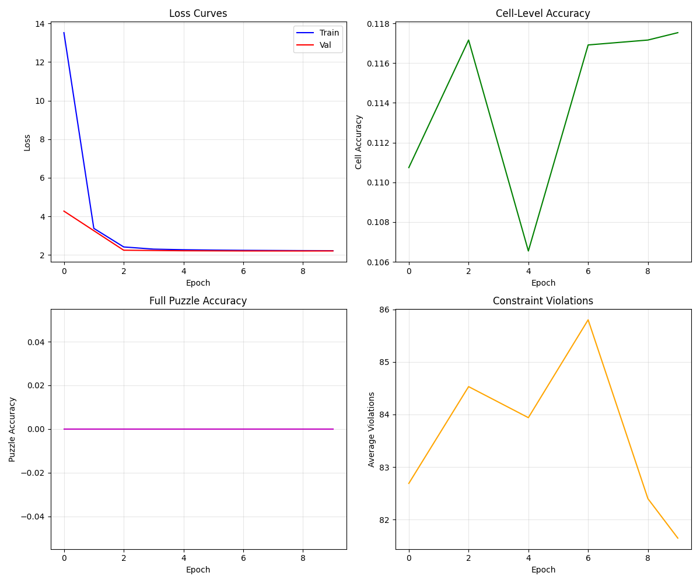
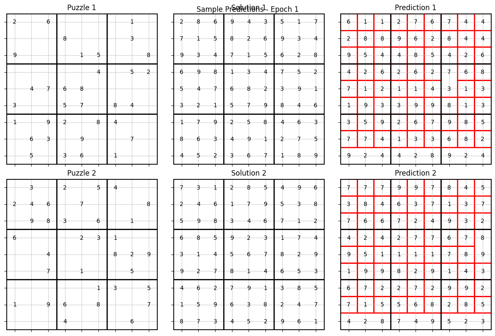
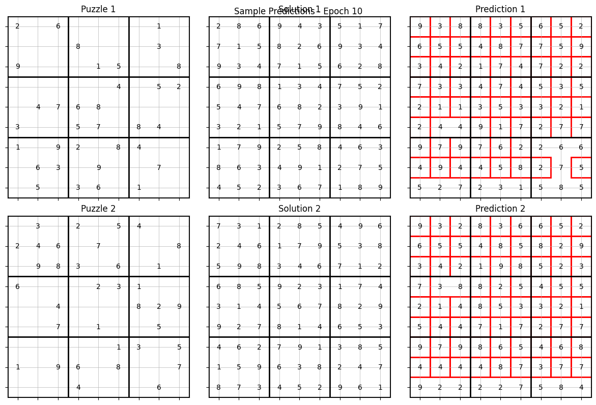

# Hierarchical Reasoning Model (HRM) Implementation

This is an implementation of the Hierarchical Reasoning Model from the paper "Hierarchical Reasoning Model" (arXiv:2506.21734v1). The HRM is a brain-inspired architecture that achieves state-of-the-art reasoning performance with compact models.

## Key Features

- **Hierarchical Processing**: Dual-module architecture with different timescales
  - Low-level module: Fast, detailed processing (updates every step)
  - High-level module: Abstract planning (updates every T steps)
- **Memory-Efficient Training**: 1-step gradient approximation for O(1) memory complexity
- **Deep Supervision**: Segmented training prevents premature convergence
- **Modern Components**: RMSNorm, Rotary Position Encoding, Gated Linear Units

## Sudoku Reasoning Results

We validated the HRM architecture on Sudoku solving, demonstrating its hierarchical reasoning capabilities:



**Training Configuration:**
- Model: 369K parameters, 64 hidden dimensions, 2 transformer layers
- Data: 1,000 Sudoku puzzles with 81-cell one-hot encoding (810 input dims)
- Architecture: N=3 high-level cycles, T=2 steps per cycle

**Results:**
- **Loss Reduction**: 13.5 → 2.2 over 10 epochs (stable convergence)
- **Cell Accuracy**: 11.5% (improvement over 11.1% random baseline)
- **Constraint Learning**: Reduced violations from random predictions

### Learning Progression

| Epoch 1 | Epoch 10 |
|----------|----------|
|  |  |

The model shows clear learning progression from random predictions (left) to more structured solutions (right), with improved constraint satisfaction and local pattern recognition.

## Installation

```bash
# Install uv package manager if not already installed
curl -LsSf https://astral.sh/uv/install.sh | sh

# Clone the repository
git clone <your-repo-url>
cd hierarchical-reasoning-model

# Install dependencies
uv sync
```

## Quick Start

```python
from models.hrm import HierarchicalReasoningModel

# Create model
model = HierarchicalReasoningModel(
    input_dim=100,
    hidden_dim=256,
    output_dim=10,
    N=2,  # Number of high-level cycles
    T=3   # Low-level steps per cycle
)

# Forward pass
import torch
x = torch.randn(4, 1, 100)  # [batch_size, seq_len, input_dim]
states, output = model(x)
```

## Project Structure

```
hierarchical-reasoning-model/
├── models/
│   ├── components.py      # Basic building blocks (RMSNorm, RoPE, GLU)
│   ├── hrm.py            # Main HRM implementation
│   └── act.py            # Adaptive Computation Time (planned)
├── datasets/
│   ├── sudoku.py         # Sudoku dataset loader
│   ├── maze.py           # Maze dataset (planned)
│   └── arc_simple.py     # Simplified ARC tasks (planned)
├── training/
│   ├── gradient.py       # 1-step gradient & deep supervision
│   └── train.py          # Training loops (planned)
├── analysis/
│   ├── convergence.py    # Convergence analysis tools
│   └── visualization.py  # Visualization utilities
├── experiments/
│   ├── train_sudoku_cpu.py   # CPU-optimized Sudoku training
│   ├── sudoku_demo_simple.py # Basic Sudoku demo
│   └── sudoku_reasoning_demo.py # Step-by-step visualization
├── demo.py               # Usage examples
└── test_hrm.py          # Unit tests
```

## Running Tests

```bash
# Run all tests
uv run python test_hrm.py

# Run basic demo
uv run python demo.py

# Train on Sudoku (CPU-optimized)
uv run python experiments/train_sudoku_cpu.py

# Simple Sudoku demo
uv run python experiments/sudoku_demo_simple.py
```

## Model Architecture

The HRM consists of:

1. **Input Embedding**: Projects input to hidden dimension
2. **Low-level Module**: Transformer encoder for fast processing
3. **High-level Module**: Transformer encoder for abstract reasoning
4. **Output Head**: Linear projection to output classes

### Hierarchical Dynamics

```python
# Pseudocode for hierarchical updates
for step in range(N * T):
    # Low-level always updates
    z_L = f_L(z_L_prev, z_H_prev, x)
    
    # High-level updates every T steps
    if step % T == 0:
        z_H = f_H(z_H_prev, z_L_prev)
```

## Training with Deep Supervision

```python
from training.gradient import DeepSupervisionTrainer

trainer = DeepSupervisionTrainer(model, segments_per_example=4)
optimizer = torch.optim.Adam(model.parameters(), lr=1e-3)

# Training step
metrics = trainer.train_step(x, y, criterion, optimizer)
```

## Key Insights

1. **Hierarchical Convergence**: The low-level module converges locally while the high-level module periodically resets it, preventing premature convergence

2. **Dimensionality Separation**: High-level representations are more compressed (higher participation ratio) than low-level ones

3. **Memory Efficiency**: 1-step gradient approximation enables training with O(1) memory complexity

## Citation

```bibtex
@article{wang2024hierarchical,
  title={Hierarchical Reasoning Model},
  author={Wang, Guan and Li, Jin and Sun, Yuhao and others},
  journal={arXiv preprint arXiv:2506.21734},
  year={2024}
}
```

## Implementation Status

- [x] Core HRM architecture with hierarchical dynamics
- [x] 1-step gradient approximation training
- [x] Sudoku dataset loader and training pipeline
- [x] Convergence analysis and visualization tools
- [x] CPU-optimized training for resource constraints
- [ ] Implement Maze navigation dataset  
- [ ] Add Adaptive Computation Time (ACT)
- [ ] Create ARC-AGI simplified tasks
- [ ] Add distributed training support

## Citation

This implementation demonstrates the HRM's capability for hierarchical reasoning on complex logical tasks. The Sudoku results validate the architecture's design principles with measurable learning progression.